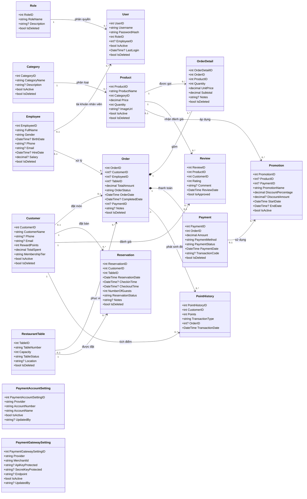
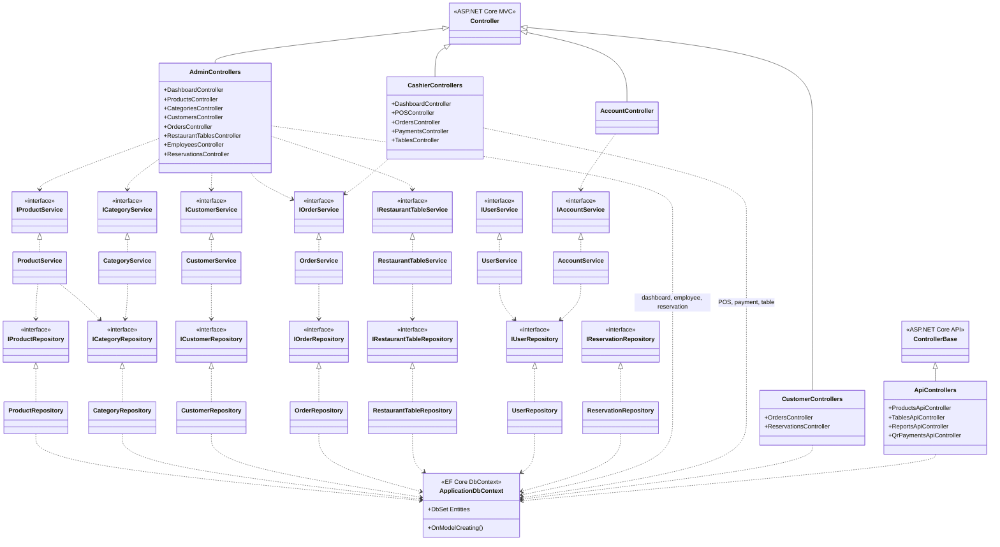
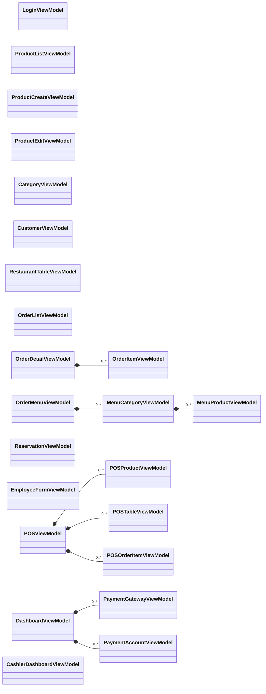

# Sơ đồ class BrewPoint

Tài liệu này phản ánh cấu trúc hiện tại của dự án ASP.NET Core MVC. GitHub có thể render trực tiếp các khối Mermaid bên dưới.

## 1. Domain model và quan hệ cơ sở dữ liệu

Ký hiệu `?` biểu thị thuộc tính có thể null. Quan hệ và lực lượng số được lấy từ `ApplicationDbContext.OnModelCreating`.

`PaymentAccountSetting` và `PaymentGatewaySetting` là cấu hình độc lập do admin quản lý. Chúng được API QR đọc khi tạo thông tin thanh toán, không có khóa ngoại tới `Payment`.

## 2. Kiến trúc lớp ứng dụng

Các controller cũ sử dụng mô hình Service/Repository; một số controller mới và các API thao tác trực tiếp qua `ApplicationDbContext`.

## 3. Các ViewModel chính

## Ghi chú thiết kế

- Hầu hết entity dùng xóa mềm qua `IsDeleted`.
- Trạng thái đơn, thanh toán và bàn hiện được lưu bằng `string`; dự án có các lớp hằng số/enum hỗ trợ nhưng chưa thống nhất hoàn toàn.
- `Order.PaymentID` tồn tại trong model, còn quan hệ một-một thực tế được EF Core ánh xạ bằng `Payment.OrderID`.
- `Customer` chưa liên kết trực tiếp với `User`; customer đăng nhập được ánh xạ theo email do controller tạo từ username.
